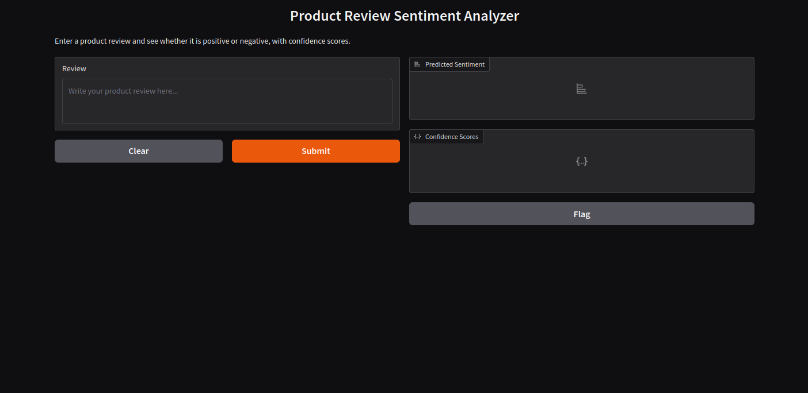
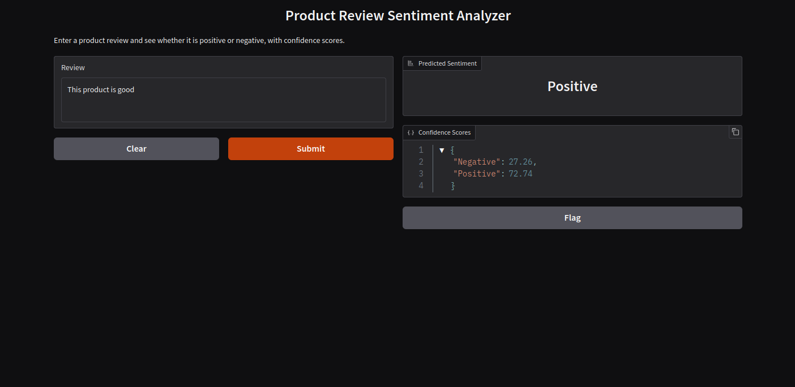

# Product Review Sentiment Analyzer

This guide walks you through creating, training, and deploying a sentiment analysis model using Scikit-learn, NLTK, and Gradio.

_`amazon_polarity`_ Dataset is used to train model. 

**Origin:** Composed by Xiang Zhang for sentiment analysis benchmarks.  
**Composition:** Includes only positive and negative reviews (3-star reviews were excluded).  
**Size:** 1.8 million training samples and 200k testing samples per class (Negative/Positive)

## Screen


## Project Setup and Run:
1. Clone the repo:  
   ```sh
    git clone https://github.com/arif123/ml-course-final-project
   ```
   
2. Navigate to project directory:
   ```sh
   cd ml-course-final-project
   ```

3. Install Dependencies:  
   ```sh
    pip install -r requirements.txt
   ```

4. Download stop word if nltk_data folder is empty.  
   ```sh
   python download_nltk_stop_words.py
   ```
   
5. Train the Sentiment Model This creates two files:sentiment_model.joblib and tfidf_vectorizer.joblib  
   ```sh
   python train_model.py
   ```

6. Run the App  
   ```sh
   python app.py
   ```

    Launches a Gradio web interface.  
    Access it via the URL printed in the console (e.g., http://127.0.0.1:7860).  
    Enter product review text and get the predicted sentiment and confidence scores.  


